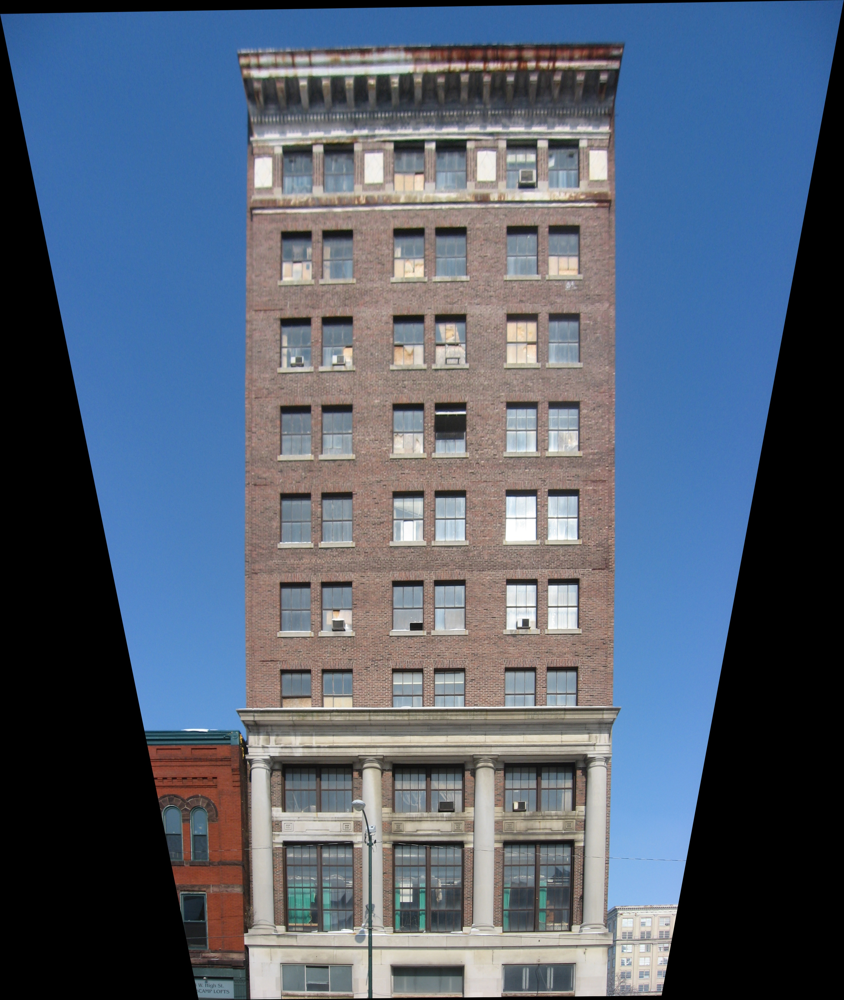

This repository contains implementation of discrete fast Hough transform,
as described in the article [1].  As an example, FHT is used to find vanishing point
and rectify building image.

Before:

After:

[1]: http://dx.doi.org/10.1137/S0097539793256673 "Martin L. Brady, A Fast Discrete Approximation Algorithm for the Radon Transform"
